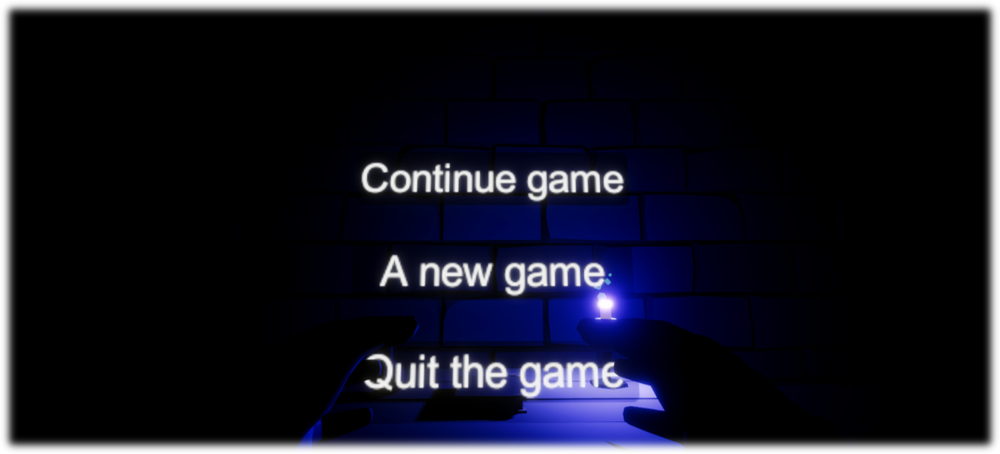
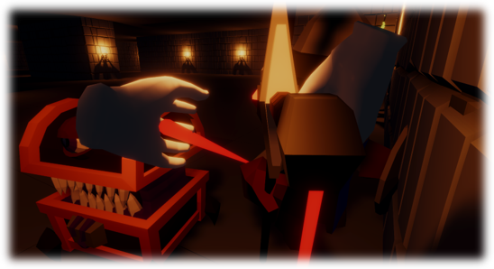

# Endless Dungeon

Welcome! This is the repository for my first Unity project where I'm making Roguelike and Dungeon crawl for VR.
___

### Table of Contents

- [Description](#description)
- [Download](#download)
- [Project status](#project-status)
    - [Implemented](#implemented)
    - [Not implemented](#not-implemented)
- [License](#license)
- [Screenshots](#screenshots)

### Description

**Endless Dungeon** is a roguelike and dungeon crawl game. The goal of the game is to go as far as possible through the
dungeon, fighting monsters and improving your character. The player will explore the different floors of the dungeon,
where he will have to deal with a variety of enemies and bosses. The game will feature procedural level generation,
which will create variety and challenges for the player. The game interface will provide the ability to select a new
game, continue, settings and exit the game. The player will be motivated by leveling up the character, unlocking new
skills and defeating increasingly difficult opponents. The game is designed for VR devices. The player will be able to
move around the dungeon, attack enemies, use skills and interact with the environment.

### Download

You can download the game from [GitHub Release](https://github.com/ShutovKS/EndlessDungeon/releases)
or [Itch.io](https://shutovks.itch.io/endless-dungeon).

### Project status

`Development paused` - No way to continue working with VR technology.

#### Implemented:

- [x] Player (Movement, attack, health, skills)
- [x] Skills (Upgrades, effects)
- [x] Weapons (Sword, Axe, Hammer), (Take, attack)
- [x] Monster (5 types), (AI: follow, attack, patrol, get damage, die)
- [x] Resources (Replenishment, write-off)
- [x] UI (Main menu, menu in main room, menu in dungeon, skills)
- [x] Dungeon generation
- [x] Saving system

#### Not implemented:

- [ ] UI (Resources, health)
- [ ] Audio (Music, sounds)

### Credits

#### Author:

- Developer Shutov Kirill, Russia

#### Link:

- [Itch.io](https://shutovks.itch.io/endless-dungeon)

### License

This project is licensed under the MIT License - see the [LICENSE](LICENSE) file for details.

### Screenshots

